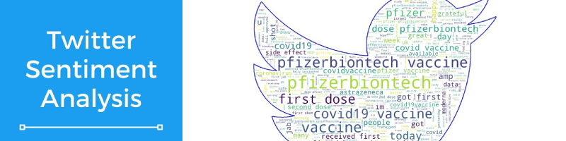
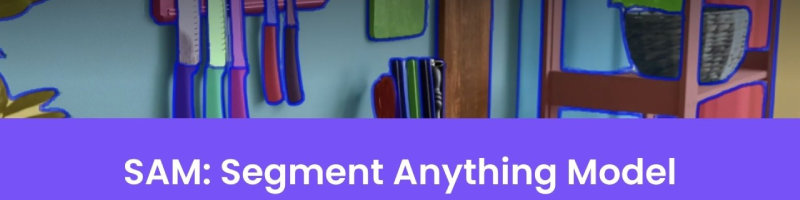

# Hello there!👋 

I’m Cristian Percivati, a passionate Computer Science and Artificial Intelligence student pursuing my first role as an **AI Engineer** or **Data Scientist**.

### Academic Background
- Associate Degree in Data Science & AI (completed).
- Currently studying Computer Science Engineering (BSc).

### Core Technical Skills
- Languages: Python, SQL, JS
- Cloud/ML Tools: Azure
- Reporting Tools: Power BI
- Frameworks: (PyTorch, TensorFlow, LangChain, HuggingFace, etc)

### What I Bring  
A blend of theoretical knowledge and practical project experience in AI/ML, with a focus on building scalable solutions.

### Get In Touch  
📧 **Email**: [cpercivatif@gmail.com](mailto:cpercivatif@gmail.com)  
📱 **Phone**: [+54 11 4063-3321](tel:+541140633321)  

### Featured Projects  
Next you can explore my technical exercises and implementations:  

  
Apps

  
--- 
  
## Apps

### EstudIA

The app helps students understand and progress in academic subjects. Built on *Langchain*, it handles chained prompts and **document retrieval**, with content stored in a vector database (*ChromaDB*). An LLM (*GPT's API*) then uses this retrieved data as context to deliver more accurate answers and questions.

The app operates in two modes:

- Conversational Mode: A free-form discussion about the subject.

- Evaluation Mode: A QA exam-style format where an **agent** evluates the student’s answers, provides feedback, and determines correctness.

Based on the user’s performance, the system tracks correct and incorrect responses, dynamically adjusting focus to reinforce weaker areas. Additionally, the app can generate summaries of the subject matter.

  
    
    
    

### Bot-to-Bot app

This app is a fun and simple way to explore how two advanced AI chatbots (GPT and Deepseek) think and respond each other, allowing you to see the difference in **biases**.

You start by entering a prompt, and then the two bots take turns chatting with each other. As their conversation goes on, you’ll notice they often take different approaches: GPT usually focuses more on privacy and individual rights, while Deepseek tends to highlight the importance of social good and collective values.

To guide the conversation a bit, the starting prompt includes an example to set the tone. Watching the two bots interact gives you an interesting look at how their training shapes their opinions, and how different kinds of AI can “see” the same topic in very different ways.

- [Ver video 👀](https://youtu.be/z35HhIoJ5gY)
- [Descargar desde Docker 🐳](https://google.com)

### Phonetics corrector

This was a personal project aimed at exploring the capabilities of OpenAI's Whisper, a speech transcription model released at the time. The app’s goal was to identify pronunciation differences in spoken words (English only).

#### Model Retraining
Fine-tuned Whisper using a public audio transcription dataset that included open mic recordings and noisy audios.
Converted dataset labels to CMU (an open pronunciation dictionary) for compatibility.

#### Functionality
The retrained model transcribes speech into CMU phonetic representations.
The original Whisper model compares this output to the actual pronunciation.
The system then identifies correctly and incorrectly pronounced phonemes.

- [Ver video 👀](https://youtu.be/lnRcwrBtzmY)
- [Descargar desde Docker 🐳](https://google.com)

Enlace a video: :movie_camera:

### DQN applied for transport problems

This project demonstrates how **simulated environments** can be created from limited original data using **data augmentation**, **causal inference**, and expansion techniques. The goal was to model how **dynamic pricing adjustments** could significantly improve growth projections for the following year.

A Deep Q-Network (DQN) was trained via **reinforcement learning**, enabling an agent (the company itself) to learn optimal pricing strategies based on environmental feedback. The resulting model provided a (synthetic) data driven estimate of how flexible pricing decisions could enhance forecasted growth curves.

#### Technical Approach:
- Data Simulation: Augmented sparse datasets to build a robust synthetic environment.
- Causal Analysis: Identified key decision drivers through inference techniques.
- Agent Training: The DQN agent learned adaptive pricing policies by interacting with the simulated market.

- [Ver video 👀](https://youtu.be/aYyind5eH5w)
- [Descargar desde Docker 🐳](https://google.com)

  
Notebooks

  
## Notebooks

### Credit card fraud detection

*Problem type*: Binary classification

The goal is to find a model that, given the provided information, can predict whether a future transaction will be fraudulent or not. In this analysis, I work with a typical dataset with a **data imbalance** problem, where **recall** is the most important metric to evaluate the model's usefulness.

I try **dimensionality reduction** techniques and data balancing like resampling or **SMOTE**. A **logistic regression** model is used as a viable option.

### IBM attrition analysis

*Problem type*: Binary classification

The idea of this work is to explain the causes of attrition and find a predictive model that can intercept future cases of attrition (wear that causes a possible resignation of an employee) to avoid **excessive turnover**. In this analysis, we also face a data imbalance problem, but in this case, false negatives are less acceptable compared to the credit card fraud example, so it was important to keep a balance between the metrics.

An EDA of the features was done, and they were selected based on correlations using hypothesis testing like **chi-square**, giving importance to data segmentation, which helped to find better correlations and choose useful features according to the target variable.

To improve the results, a **SMOTE** was applied that helped the model perform better. In this case, **XGBoost** was used since the relationships were not very linear.

### Spaceship Titanic Competition

This was a project I did during the Data Science course at the institute. After a deep EDA, I was able to explain the correlations between variables and do some **feature engineering**. The best-performing model was a **deep neural network**, but to explain the results I used a **SHAP** analysis.

*Problem type*: Binary classification

### Buenos Aires Properati Price Prediction

This project is one of my first notebooks, based on the classic real estate price **regression** problem, but this time using a Properati dataset for descriptive and predictive analysis of property prices in Buenos Aires City.

*Problem type*: Regression

### Twitter dataset NLP analysis

*Problem type*: Sentiment analysis / Multiclass classification

The **BERT transformer** is used to classify tweets from an Indian Twitter dataset.

### Uber NY NLP analysis

This was the exploratory analysis before developing a model that generates comments simulating a passenger review. I did basic NLP preprocessing (**lemmatization** and removing **stop words**) and then vectorized the vocabulary using **CountVectorizer**. This allowed me to create a word cloud showing the most positive and most negative words used by passengers.

*Problem type*: Sentiment analysis / Word cloud

### YOLO object detection

In this exercise, I used the **YOLOv8** library to detect objects in an image.

*Problem type*: Object detection in computer vision

### SAM image segmentation

In this exercise, I used the **SAM** library for image segmentation.

*Problem type*: Image segmentation in computer vision

Models

## Models and Fine-Tuning
<table>
  <tr>
    <td style="vertical-align: top; width: 100px;">
      
    </td>
    <td>
      <h3>Whisper fine-tuned for CMU</h3>
      I did a <strong>fine-tuning</strong> of the base version of Whisper from OpenAI. The idea was to use it in my app (shared above) that helps correct phonetic pronunciation errors.
    </td>
  </tr>
  <tr>
    <td style="vertical-align: top;">
      
    </td>
    <td>
      <h3>Llama 3B fine-tuned for Uber dataset</h3>
      The fine-tuning (done with <strong>QLoRA</strong>) was used to adapt the 3B version of Llama 3 so it could simulate being a passenger based on a custom trip dataset. According to the trip data, it generated <strong>synthetic</strong> comments and ratings.
    </td>
  </tr>
  <tr>
    <td style="vertical-align: top;">
      
    </td>
    <td>
      <h3>Deep Reinforcement Learning DQN for transport problems</h3>
      This model was part of a final project for my technical degree. The idea was to use a DQN with <strong>Deep Reinforcement Learning</strong> to create a set of predictive <strong>synthetic data</strong> that shows the effect that <strong>simulated decision-making</strong> can have on the service fare and the benefits of making it dynamic.
    </td>
  </tr>
</table>

  

Dashboards

  
## Dashboards
### Data Market Report

This dashboard was a project I did during an internship at the Institute. In this report, I analyzed the job offers from ai-jobs.net. Then, using **scraping** techniques, I collected the equivalent offers from LinkedIn Argentina.

### Data Warehousing Example

This was an exercise I did during a training at Quales. The idea was to apply **ETL** with **SQL** to transform separate CSV files into a **Data Warehouse** ready to be used in Power BI.

### Power BI Exercise

This is a simple exercise I did a few years ago in a Udemy course.

