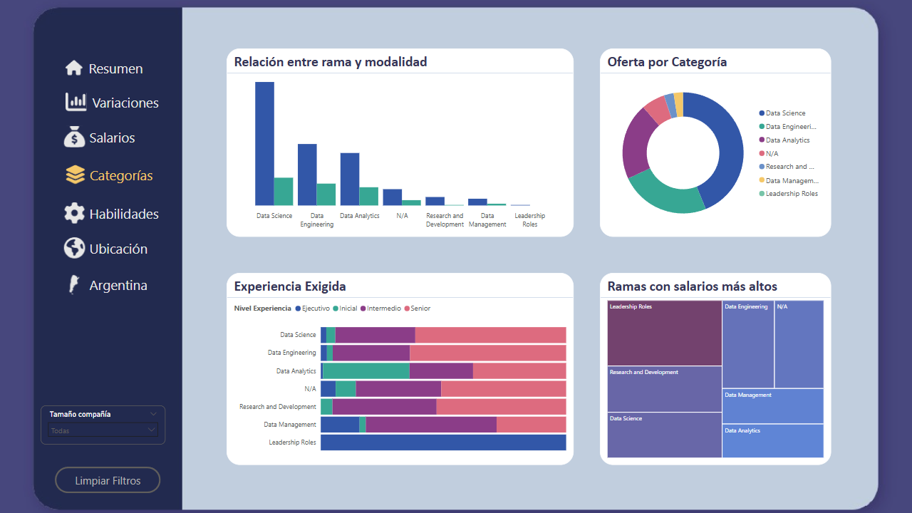
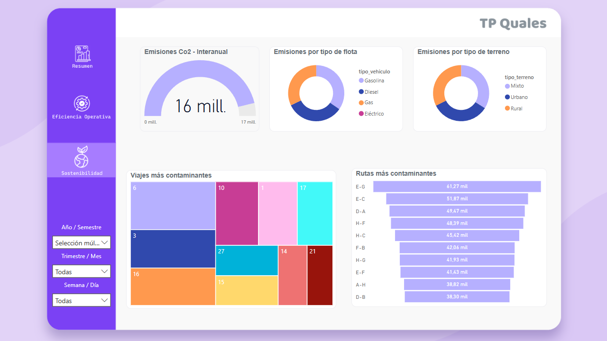
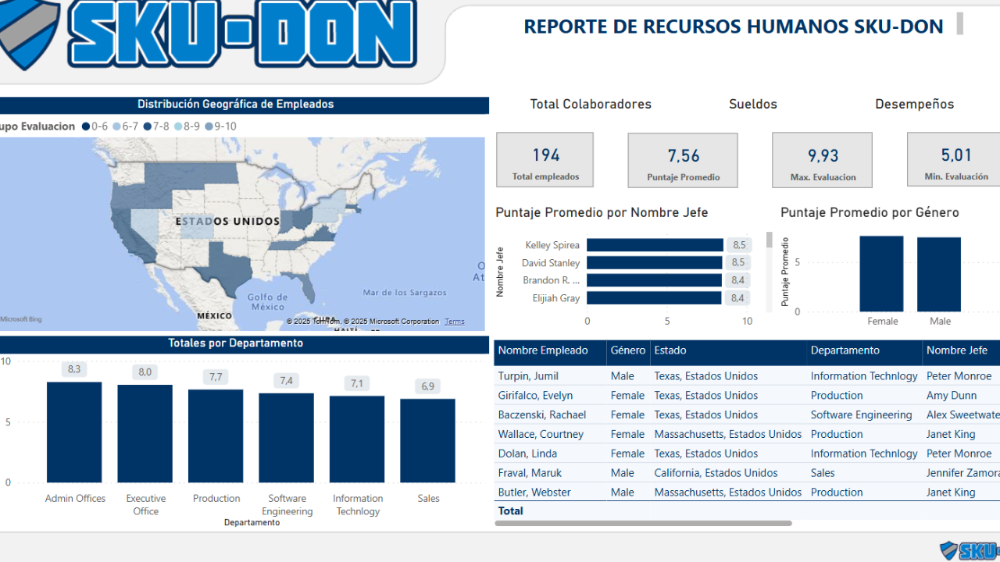

# Hola!👋 

Mi nombre es Cristian Percivati, soy un estudiante apasionado de las Ciencias de la Computación e Iteligencia Artificial que está buscando su primer rol como **Ingeniero de IA** o **Científico de Datos** (u otras posiciones).

### Background Académico
- Técnico Superior en Ciencia de Datos e Inteligencia Artificial (completado)
- Actualmente estudiando Ingeniería Informática en la UBA

### Habilidades Técnicas Centrales
- Lenguajes: Python, SQL, JS
- Cloud & Deployment: Azure, Docker, Github
- Herramientas de Reporting: Power BI
- Frameworks: (PyTorch, TensorFlow, LangChain, HuggingFace, etc)

### ¿Qué ofrezco?
Una mezcla de conocimiento teórico y práctico en proyectos de IA/ML con un enfoque en construir soluciones escalables.

### ¿Cómo contactarme?  
📧 **Email**: [cpercivatif@gmail.com](mailto:cpercivatif@gmail.com)  
📱 **Phone**: [+54 11 4063-3321](tel:+541140633321)  

### Proyectos Destacados
A continuación se puede explorar mis ejercicios técnicos e implementaciones en distintas áreas de datos:

  
Apps

  
--- 
  
## Apps

### EstudIA

Esta aplicación ayuda a los estudiantes a entender y progresar en temas académicos. Construida sobre *Langchain*, maneja chains de prompts en base a **recuperación de documentos**, con el contenido almacenado en una base de datos vectorial (*ChromaDB*). Un LLM (*API de GPT*) se encarga de usar esta información recuperada como contexto para presentar respuestas y preguntas más precisas.

La aplicación opera en dos modos:

- Modo conversacional: una forma libre de discusión acerca de la materia.

- Modo evaluación: Un ping-pong de preguntas y respuestas en formato de examen donde un **agente** evalúa la respuesta del usuario, provee feedback y determina el nivel de correcto de la misma.

Basado en la performance del usuario, el sistem trackea las respuestas correctas e incorrectas, ajustando dinámicamente su enfoque en reforzar las áreas débiles del mismo. Adicionalmente, la aplicación puede generar resúmenes de la materia en cuestión.

  
    
    
    

### Bot-to-Bot app

Esta aplicación fue una forma fácil y entretenida de explorar cómo dos modelos avanzados de chatbots de IA (GPT y Deepseek) piensan y se responden el uno al otro, permitiendo ver las diferencias en los **sesgos** de cada uno.

Se comienza lanzando un prompt inicial, entonces ambos chatbots toman turnos para chatear el uno con el otro. A medida que la conversación avanza, y dependiendo del prompt, se podrá observar que cada uno toma enfoques diferentes: GPT normalmente se enfoca más en la privacidad y los derechos individuales, mientras que Deepseek tiende a resaltar la importancia del bienestar social y los valores colectivos.

Para guiar la conversación, el prompt inicial incluye un ejemplo para establecer un tenor de conversación. Ver a ambos bots interactuar nos da una mirada interesante en cómo sus entrenamientos moldearon sus opiniones, y cómo diferentes tipos de IA pueden ver el mismo tema en formas muy diferentes.

  
    
    
    

### Corrector de fonética

Este fue un proyecto personal que apuntaba a explorar las capacidades de Whisper de OpenAI, un modelo de transcripción del habla que lanzó hace un par de años. El objetivo de la app era identificar las diferencias de pronunciación (solo en inglés).

#### Reentrenamiento del modelo

El **ajuste fino** de Whisper (reentrenamiento a partir de los pesos pre-entrenados en su versión *base*) se realizó usando un dataset de audio público que incluía grabaciones a micrófono abierto y audios ruidosos. Las etiquetas de este dataset (transcripciones) se convirtieron a CMU (un diccionario de fonemas de pronunciación abierto), y estas etiquetas convertidas se brindaron al modelo como variable de salida para el entrenamiento.

#### Functionamiento

El modelo reentrenado transcribe el audio en representacaiones fonéticas en CMU.
El modelo original de Whisper compara esta salida con la pronunciación real.
El sistema identifica correcta e incorrectamente los fonemas mal pronunciados.

  
    
    
    

### DQN aplicada a problemas de transporte de pasajeros

Este proyecto demuestra cómo los **entornos simulados** pueden ser creados a partir de datos limitados usando **aumento de datos**, **inferencia casual**, y técnicas de expansión. El objetivo era modelar cómo el **ajuste de precios dinámicos** de las tarifas podría significativamente mejorar las proyecciones de crecimiento al año siguiente.

Una Deep Q-Network (DQN) fue entrenada a través de **aprendizaje por refuerzo**, permitiendo que un agente (representando a la compañía tomando decisiones) aprendiera estrategias de ajuste de precios óptimos de la tarifa basado en el feedback del entorno. El modelo resultante brindó la posibilidad evaluar cómo la cultura de datos puede brindar estimaciones data-driven en cómo decisiones como flexibilizar de forma correcta las tarifas podría mejorar la curva de crecimiento de ingresos.

#### Enfoque Técnico:
- Simulación de Datos: El aumento de datos en datasets escasos permitieron construir un entorno de datos sintéticos robusto.
- Análisis Causal: Se identificaron tomas de decisiones claves a través de técnicas de inferencia de otros datasets relacionados.
- Entrenamiento del Agente: la DQN del agente aprendió adaptativamente a tomar decisiones sobre los precios interactuando con el mercado simulado (entorno).

  
    
    

  
Notebooks

--- 

## Notebooks

### Credit card fraud detection

*Tipo de problema*: Clasificación binaria 

El objetivo es encontrar un modelo que, dada la información brindada, sea capaz de predecir si una transacción futura será fraudulenta o no. En este análisis lo que hago es el tratamiento de un típico dataset con un problema de **desbalanceo de datos**, donde el **recall** es la métrica más relevante para evaluar la utilidad del modelo que se utilice. 

Pruebo técnicas de **reducción de dimensionalidad**, y de balanceo de datos como resampling o **SMOTE**. Se utiliza una **regresión logística** como modelo viable.

### IBM attrition analysis

*Tipo de problema*: Clasificación binaria 

La idea del trabajo es explicar las causas del attrition y encontrar algún modelo predictivo que permita interceptar futuros casos de attrition (desgaste que provocan el posible renunciamiento de un empleado) para evitar la **rotación excesiva**. En este análisis también se nos presenta un problema de desbalanceo de datos, pero en este caso es menos permisibile los falsos negativos respecto al ejemplo de fraude de tarjetas, por lo cual se necesitaba mantener un balance de estas métricas. 

Se hizo un EDA de las características, y se seleccionó en función de las correlaciones teniendo en cuenta tests de hipótesis como **chi cuadrado** y dándole importancia a la segmentación de los datos, que nos permitió ver mejores correlaciones y elegir las características útiles en función de la variable objetivo.

Para mejorar los resultados, se realizó un **SMOTE** que permitió mejorar los resultados del modelo, en este caso se utilizó **XGBoost** dado que las relaciones son poco lineales.

### Spaceship Titanic Competition

Este fue un trabajo que hice durante la materia de Cs. de Datos en el instituto. Tras un EDA profundo, se logró una buena explicabilidad de la correlación de las variables e **ingeniería de características**. Como modelo, el que mejor resultado dio fue una **red neuronal profunda**, pero para poder explicar los resultados recurrí a un análisis **SHAP**.

*Tipo de problema*: Clasificación binaria 

### Buenos Aires Properati Price Prediction

Este trabajo es uno de mis primeros notebooks, basado en el clásico problema de regresión de los precios de propiedades, pero esta vez utilizando un dataset de Properati para el análisis descriptivo y predictivo
de precios de inmuebles de la Ciudad de Buenos Aires.

*Tipo de problema*: Regresión 

### Twitter dataset NLP analysis

*Tipo de problema*: Análisis de sentimientos / Clasificación multiclase

Se utiliza el **transformer BERT** para la clasificación de twits de un dataset de Twitter de la India.

### Uber NY NLP analysis

Este fue el análisis exploratorio previo a desarrollar el modelo que genere comentarios simulando ser un pasajero de un viaje. Se hizo un trabajo de preprocesamiento de NLP básico (**lemmatización** y eliminación de **stop words**) y luego se vectorizó el vocabulario con **CountVectorizer**. Esto me permitió realizar una nube de palabras de las palabras más positivas y más negativas realizadas por los pasajeros.

*Tipo de problema*: Análisis de sentimientos / Nube de palabras

### YOLO object detection

En este ejercicio, lo que se hizo fue utilizar la librería de **YOLOv8** para la detección de objetos en una imagen.

*Tipo de problema*: Detección de objetos en computer vision

### SAM image segmentation

En este ejercicio, lo que se hizo fue utilizar la librería de **SAM** para la segmentación de imágenes.

*Tipo de problema*: Segmentación de imágense en computer vision

Models

  
## Modelos y ajuste fino
<table>
  <tr>
    <td style="vertical-align: top; width: 150px;">
      
    </td>
    <td>
      <h3>Whisper fine-tuned for CMU</h3>
      Realicé un <strong>ajuste fino</strong> a la versión base de Whisper de OpenAI. La idea era poder utilizarlo en mi app (compartida más arriba) que permite corregir errores fonéticos en la pronunciación.
    </td>
  </tr>
  <tr>
    <td style="vertical-align: top;">
      
    </td>
    <td>
      <h3>Llama 3B fine-tuned for Uber dataset</h3>
      El ajuste fino (realizado con <strong>QLoRA</strong>) se utilizó para adaptar la versión de 3B de Llama 3 para que simule ser un pasajero según un dataset de viajes propio que se le brindó. En función de los datos de los viajes, generó comentarios y calificaciones <strong>sintéticas</strong>.
    </td>
  </tr>
  <tr>
    <td style="vertical-align: top;">
      
    </td>
    <td>
      <h3>Deep Reinforcement Learning DQN for transport problems</h3>
      Este modelo fue parte de un trabajo práctico integrador para mi tecnicatura. La idea fue usar una DQN utilizando <strong>Deep Reinforcement Learning</strong> que me permitiera desarrollar un conjunto de <strong>datos sintéticos</strong> predictivos que demuestren el efecto que puede tener la <strong>toma de decisiones simulada</strong> sobre la tarifa del servicio y los beneficios de la dinamización de la misma.
    </td>
  </tr>
</table>

  

Dashboards

--- 

## Dashboards

### Reporte sobre el mercado de datos

Este dashboard fue un proyecto que realicé durante unas prácticas en el Instituto. En este reporte lo que hice fue analizar la oferta laboral de ai-jobs.net. Luego, usando técnicas de **scrapping**, obtuve las ofertas equivalentes en Linkedin Argentina.

### Ejemplo de Data Warehousing

Este fue un ejercicio realizado para una capacitación en Quales. La idea era aplicar **ETL** con **SQL** para transformar archivos csv sueltos en un **Data Warehouse** listo para ser consumido en PBI.

### Ejercicio de PBI

Este es un simple ejercicio que realicé hace algunos años en un curso de Udemy.

