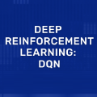

# Portfolio de prácticas

## Apps

### EstudIA

Esta aplicación fue un proyecto que desarrollé durante una práctica en el Instituto. La app es básicamente un **agente** que ayuda al alumno a entender y a progresar sobre ciertos temas académicos. Básicamente, funciona a través de Langchain para la **recuperación de documentos**, que son vectorizados y almacenados en una **base de datos vectorial** (ChromaDB). Luego, se utiliza un **LLM** (la API de GPT) para que asuma esta documentación como contexto para las preguntas del usuario. En base las respuestas que el usuario va dando, el LLM también almacena un seguimiento de los errores y aciertos del mismo, y toma decisiones sobre qué temas profundizar y ajustar sus preguntas en función a los conocimientos del mismo. También permite realizar resúmenes de los textos vistos.

### Bot-to-Bot app

Esta aplicación es un sencillo ejercicio de prueba donde se utilizan dos modelos de LLM de competencia actual (GPT y Deepseek) para que interactúen entre sí. Se presentan en un formato de sala de chat, donde el usuario hace un prompt inicial y los chatbots van interactuando entre sí. Dependiendo del prompt inicial, los chats durante el intercambio van dejando entrever los sesgos internos que poseen a la hora de dar respuestas, siendo GPT más enfocado en la privacidad y el individuo, mientras que Deepseek se apoya más en la utilidad social y la importancia de lo colectivo. Este prompt inicial está ajustado internamente con un prompt one-shot para mejorar su precisión y dirigir correctamente el desarrollo de la conversación.

### Phonetics corrector

Este fue un proyecto personal que tenía como fin explorar las posibilidades de un modelo transcripción de voz de OpenAI que había salido en ese momento, llamado **Whisper**. La idea de la app es buscar diferencias en la pronunciación de las palabras. Para esto, reentrené el modelo con un dataset público de transcipción de audio. El entrenamiento requirió que se convirtieran las etiquetas del dataset a CMU (un diccionario de pronunciación abierto). La app lo que hace es utilizar este modelo reentrenado para realizar una transcripción a CMU, y por el otro utiliza el modelo original para compararlo con la pronunciación real, de esta forma reconoce los fonemas que fueron correcta e incorrectamente pronunciados.

### DQN applied for transport problems

Este fue un trabajo de **Deep Reinforcement Learning**. La aplicación demuestra cómo, con muy pocos datos, se pudo realizar un **entorno simulado** a partir de los datos originales, utilizando técnicas de aumento y expansión de datos e inferencia causal resultado del análisis. El objetivo del trabajo fue demostrar un *estimativo* de cómo la toma de decisiones sobre la flexiblización de las tarifas, permitiría un crecimiento mucho mayor en la curva de pronóstico para el año siguiente. Se utilizó una **DQN** que permite el aprendizaje (por refuerzo) de un **agente** (en este caso, la propia empresa) respecto a las decisiones que tome en las tarifas dependiendo del entorno.

## Notebooks

### Credit card fraud detection

*Tipo de problema*: Clasificación binaria 

El objetivo es encontrar un modelo que, dada la información brindada, sea capaz de predecir si una transacción futura será fraudulenta o no. En este análisis lo que hago es el tratamiento de un típico dataset con un problema de **desbalanceo de datos**, donde el **recall** es la métrica más relevante para evaluar la utilidad del modelo que se utilice. 

Pruebo técnicas de **reducción de dimensionalidad**, y de balanceo de datos como resampling o **SMOTE**. Se utiliza una **regresión logística** como modelo viable.

### IBM attrition analysis

*Tipo de problema*: Clasificación binaria 

La idea del trabajo es explicar las causas del attrition y encontrar algún modelo predictivo que permita interceptar futuros casos de attrition (desgaste que provocan el posible renunciamiento de un empleado) para evitar la **rotación excesiva**. En este análisis también se nos presenta un problema de desbalanceo de datos, pero en este caso es menos permisibile los falsos negativos respecto al ejemplo de fraude de tarjetas, por lo cual se necesitaba mantener un balance de estas métricas. 

Se hizo un EDA de las características, y se seleccionó en función de las correlaciones teniendo en cuenta tests de hipótesis como **chi cuadrado** y dándole importancia a la segmentación de los datos, que nos permitió ver mejores correlaciones y elegir las características útiles en función de la variable objetivo.

Para mejorar los resultados, se realizó un **SMOTE** que permitió mejorar los resultados del modelo, en este caso se utilizó **XGBoost** dado que las relaciones son poco lineales.

### Spaceship Titanic Competition

*Tipo de problema*: Clasificación binaria 

### Buenos Aires Properati Price Prediction

*Tipo de problema*: Regresión 

### Twitter dataset NLP analysis

*Tipo de problema*: Análisis de sentimientos / Clasificación multiclase

Se utiliza un **transformer ROBERTA** para la clasificación de twits de un dataset de Twitter de la India.

### Uber NY NLP analysis
[]{ width="800" height="120" style="display: block; margin: 0 auto" }
*Tipo de problema*: Análisis de sentimientos / Nube de palabras

### YOLO object detection

En este ejercicio, lo que se hizo fue utilizar la librería de **YOLOv8** para la detección de imágenes en tiempo real.

*Tipo de problema*: Detección de imágenes

## Modelos y ajuste fino

### Whisper fine-tuned for CMU

Realicé un **ajuste fino** a la versión base de Whisper de OpenAI. La idea era poder utilizarlo en mi app (compartida más arriba) que permite corregir errores fonéticos en la pronunciación.

---

### Llama 3B fine-tuned for Uber dataset

El ajuste fino (realizado con **QLoRA**) se utilizó para adaptar la versión de 3B de Llama 3 para que simule ser un pasajero según un dataset de viajes propio que se le brindó. En función de los datos de los viajes, generó comentarios y calificaciones **sintéticas**.

---

### Deep Reinforcement Learning DQN for transport problems

Este modelo fue parte de un trabajo práctico integrador para mi tecnicatura. La idea fue usar una DQN utilizando **Deep Reinforcement Learning** que me permitiera desarrollar un conjunto de **datos sintéticos** predictivos que demuestren el efecto que puede tener la **toma de decisiones simulada** sobre la tarifa del servicio y los beneficios de la dinamización de la misma.

## Dashboards

### Reporte sobre el mercado de datos

Este dashboard fue un proyecto que realicé durante unas prácticas en el Instituto. En este reporte lo que hice fue analizar la oferta laboral de ai-jobs.net. Luego, usando técnicas de **scrapping**, obtuve las ofertas equivalentes en Linkedin Argentina.

### Ejemplo de Data Warehousing

Este fue un ejercicio realizado para una capacitación en Quales. La idea era aplicar **ETL** con **SQL** para transformar archivos csv sueltos en un **Data Warehouse** listo para ser consumido en PBI.

### Ejercicio de PBI

Este es un simple ejercicio que realicé hace algunos años en un curso de Udemy.

